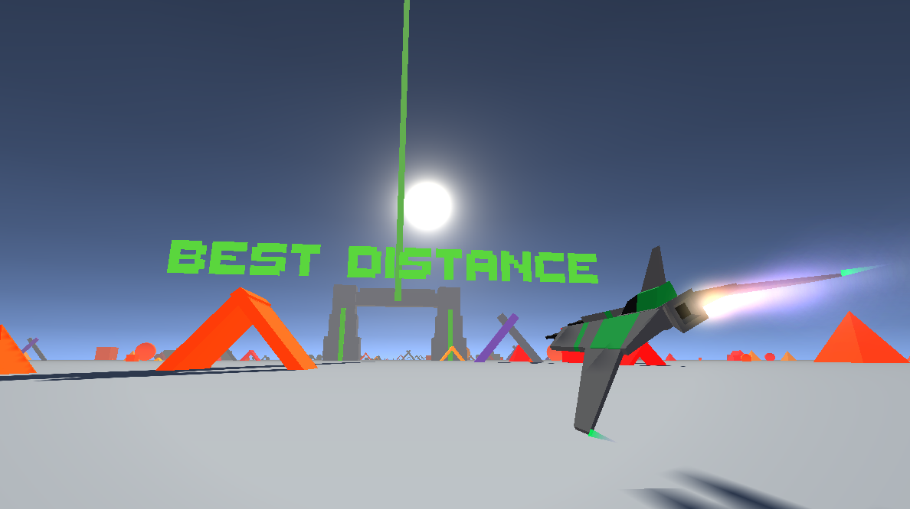

	
	
	
	
	

Built with ❤︎ by <a href="https://github.com/iamtomhewitt">Tom Hewitt</a>

Become a Beta Tester <a href="https://play.google.com/apps/testing/com.BlueRobotGames.JetDashVR">here!</a>

------------

## Getting Started 🛠
- Install [Unity Hub](https://unity.com/) and open the project with latest version of Unity.
- If you want to test on an Android device you will need to install the Android modules via Unity Hub.

## Acknowledgements 🙌

- Liz Reddington for the spaceship models. Check her out [here](https://www.artstation.com/lizred)!
