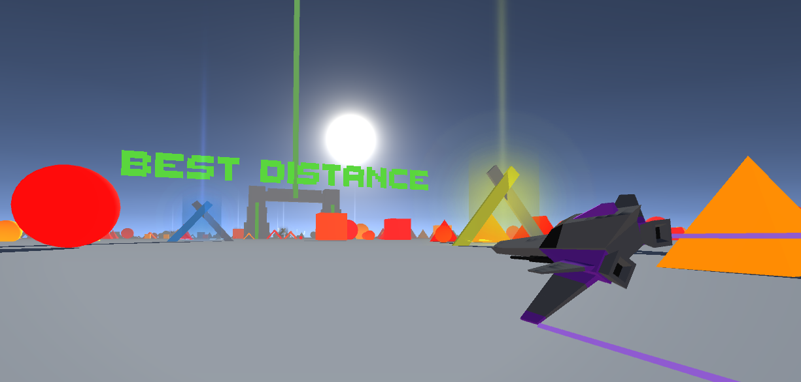

	
	
	

	
	

<i>An endless runner style game, with both virtual and non virtual reality versions, targeted for mobile devices using device holders like Google Cardboard.</i>

Built with ❤︎ by <a href="https://github.com/iamtomhewitt">Tom Hewitt</a>

Become a Beta Tester <a href="https://play.google.com/apps/testing/com.BlueRobotGames.JetDashVR">here!</a>

------------

## Getting Started 🛠
- Install [Unity Hub](https://unity.com/) and open the project with latest version of Unity.
- If you want to test on an Android device you will need to install the Android module.

## Contributing 🎉

See [Contributing](CONTRIBUTING.md) on how to contribute.

## Versioning 🗂

Versioning is similar to Semantic versioning - <b>MAJOR.MINOR.PATCH</b> <i>(e.g 2.1.4)</i>

* <b>MAJOR</b> is incremented when a new feature has been introduced (like achievements being added to the game)
* <b>MINOR</b> is incremented when there is a visual change that the player would see (like a menu change or a colour change)
* <b>PATCH</b> is incremented when there has been only a code change (like a bug fix)

## Code Style 💎

See [Code Style](CODESTYLE.md) for how to style your scripts.

## Acknowledgements 🙌

- Carmine T. Guida for [Dreamlo](http://dreamlo.com/). It's a very easy to use online leaderboard and I've used it in many of my projects.
- Liz Reddington for the spaceship models. Check her out [here](https://www.artstation.com/lizred)!
